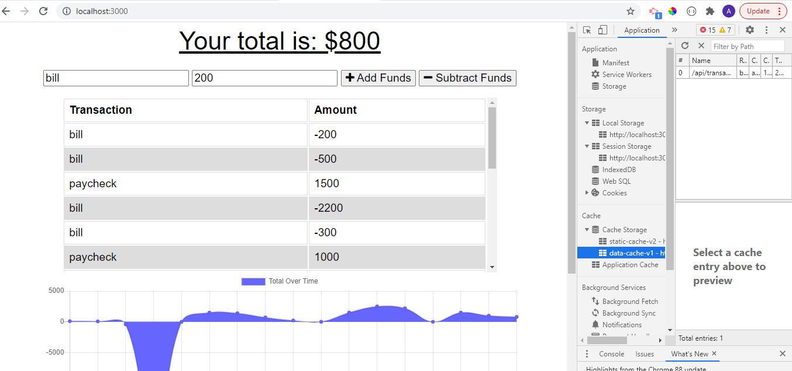

# Budget-Tracker-PWA

## Description
The budget tracker application allows the user to add expenses and deposits to their budget while both online and offline.

## Repository / Deployment
[Budget-Tracker-PWA](https://www.github.com/awpdev/Budget-Tracker-PWA)

## Visuals
[Video Demonstration](https://drive.google.com/file/d/1yCRJnGiNu4M2irfYXFrAp579C2HLmett/view) of Budget Tracker

## Credits
https://developers.google.com/web/fundamentals/primers/service-workers

Trilogy Education Services example code